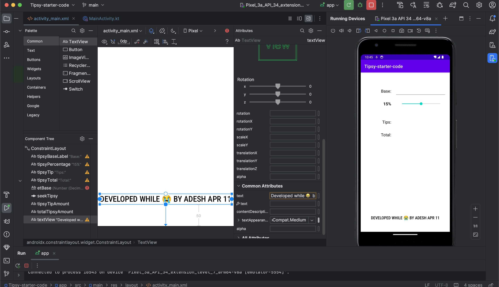
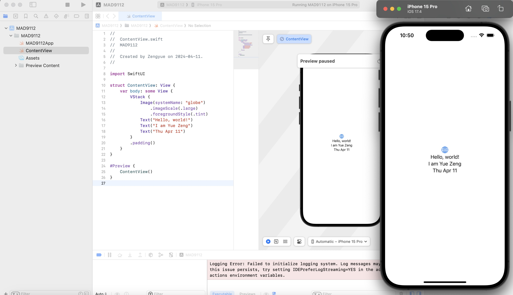

# Yue Zeng, zeng0057

```js
function calculateBMI(weight, height) {
  let myHeight = height * height;
  return weight / myHeight;
}
console.log(calculateBMI(90, 1.91));

let bmi = calculateBMI(90, 1.91);

function interpretBMI(bmi) {
  if (bmi < 18.5) {
    return "Underweight";
  }
  if (18.5 <= bmi < 25) {
    return "Normal weight";
  }
  if (25 <= bmi < 30) {
    return "Overweight";
  }
  if (bmi >= 30) {
    return "Obese";
  }
}
console.log(interpretBMI(bmi));

let bmi = calculateBMI(90, 1.91);
function interpretBMI(bmi) {
  if (bmi < 18.5) {
    return "Underweight";
  }
  if (18.5 <= bmi < 25) {
    return "Normal weight";
  }
  if (25 <= bmi < 30) {
    return "Overweight";
  }
  if (bmi >= 30) {
    return "Obese";
  }
}
console.log(interpretBMI(bmi));
```




